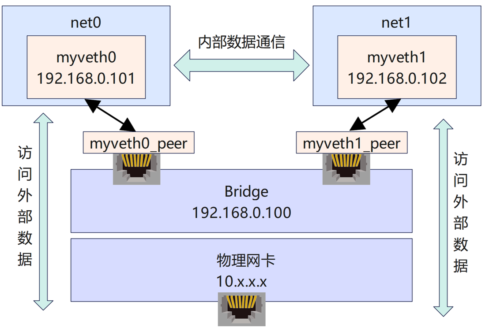

### virtual-net-device
支持网络功能卸载的虚拟网卡，包括IP/TCP/UDP/SCTP checksum功能的卸载，TSO/RSC功能的卸载
* 运行方式及性能展示：https://www.bilibili.com/video/BV1ag411q75v/
* 虚拟机吞吐性能：22.8Gbps
* 物理机吞吐性能：29.3Gbps

* 整体运行在**Linux-hwe-5.4-headers-5.4.0.122**编译环境下
* 共设置两个网卡，拓扑图如下图所示


* **refresh_veth.sh**: 负责编译网卡文件，卸载旧模块，刷新新模块（需要修改文件内的路径地址）
* **veth_net_set.sh**: 负责配置网络容器以及网络环境（需要修改文件内的路径地址）
* **Makefile**: 负责编译myveth.c  refresh_veth.sh中也有使用
* **sctp_send.c / sctp_rcv.c**: 测试sctp协议通信，需要先启动sctp_rcv文件

### 虚拟机测试环境：
测试环境：
 - 虚拟机软件: VMware Workstation Pro
 - 虚拟机系统: Ubuntu 18.04 LTS
 - 虚拟机内存: 8 G
 - 虚拟处理器: 4线程
 - Linux内核版本: 5.4.0.124-generic

 - 物理机CPU: Intel i5-1135G7  
	     8线程   2.40GHz
 - 物理机内存: 16 G

 - 测试工具: iperf3 (TCP协议传输)

测试结果：
 - 吞吐量         22.8 Gbps
 - 重传次数      206
 - 仅加法运算，可卸载1.4G次运算每秒
### 物理机测试环境
测试环境：
 - 物理机系统: Ubuntu 20.04 LTS
 - Linux内核版本: 5.15.0.48-generic
 - 物理机CPU: Intel i5-4570  
	     4线程   3.20GHz
 - 物理机内存: 4 G
 - 测试工具: iperf3 (TCP协议传输)

测试结果：
 - 吞吐量         29.3 Gbps
 - 重传次数      644
 - 仅加法运算，可卸载1.8G次运算每秒

### 运行方式：

```
# 编译sctp测试文件
gcc -Wall -o sctp_send sctp_send.c -lsctp
gcc -Wall -o sctp_rcv sctp_rcv.c -lsctp
# 运行测试文件
sudo ip netns exec net1 ./sctp_rcv
sudo ip netns exec net0 ./sctp_send
```
* **tcp_send.c / sctp_rcv.c**: 测试tcp协议通信，需要先启动tcp_rcv文件


```
# 编译tcp测试文件
gcc tcp_send.c -o tcp_send
gcc tcp_rcv.c -o tcp_rcv
# 运行测试文件
sudo ip netns exec net1 ./tcp_rcv
sudo ip netns exec net0 ./tcp_send
```
* **udp_send.c / udp_rcv.c**: 测试udp协议通信，需要先启动udp_rcv文件
* **udp_send2.c**: 手动构造ip及udp报头，测试checksum卸载
```
# 编译udp测试文件
gcc udp_send.c -o udp_send
gcc udp_send2.c -o udp_send2
gcc udp_rcv.c -o udp_rcv
# 运行测试文件
sudo ip netns exec net1 ./udp_rcv
sudo ip netns exec net0 ./udp_send
sudo ip netns exec net0 ./udp_send2
```
